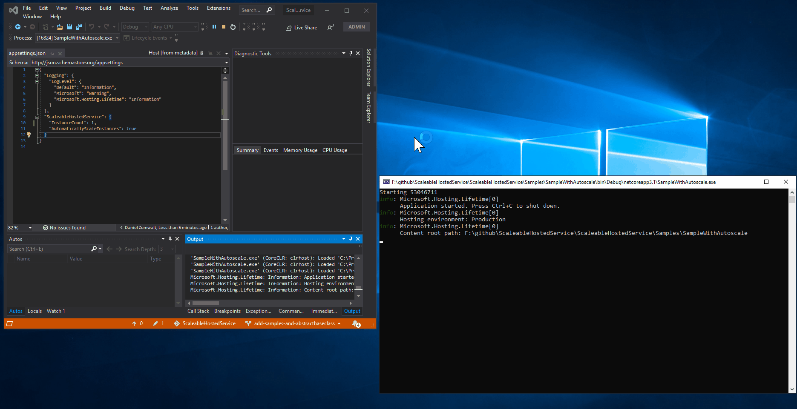

# ScaleableHostedService

An implementation of aspnetcore's IHostedService which can scale in or out dynamically within the hosting process

### Check out the sample for an idea of how to integrate into your own project

